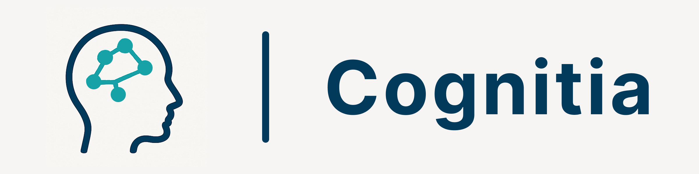
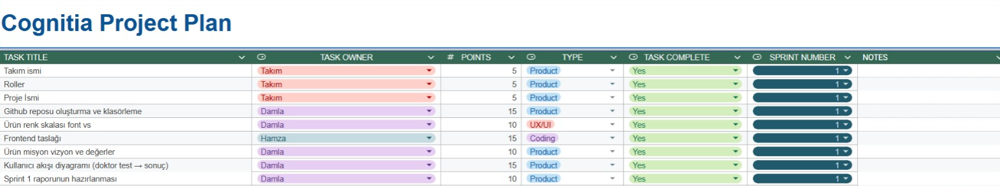

# Cognitia

  
<strong>ℹ️ Information About Team and Product</strong>

  &nbsp;

&emsp;&emsp; *Cognitia* is an AI-powered decision support tool designed for mental health professionals. It helps clinicians interpret psychological test results efficiently and consistently. By transforming raw test scores into structured insights using machine learning, Cognitia supports early identification of mental health risks, provides AI-generated summaries, enhances diagnostic clarity and fasten the diagnose process. The platform prioritizes data privacy, and alignment with clinical workflows, making it a reliable companion in psychological evaluation.

  ### 👥 Team Members

  | Name              | Title           | Communication |
  |-------------------|------------------|---------|
  | Damla Demirok  | Scrum Master   |         |
  |  | Product Owner |         |
  | Hamza Tulmaç | Developer     |         |
  |  | Developer     |         |
 

---

  
<strong>📦 Product Description and Main Aim</strong>

  &nbsp;
  
&emsp;&emsp;This project aims to develop a web-based mental health decision support system that integrates standardized psychological tests with machine learning models. Through a two-stage AI pipeline, the system will first analyze user-submitted test scores, then transform them to more academic baseline. After that it will generate evidence-based probability distribution on mental illness types to support clinicians in their decision-making process. The project follows an agile development methodology over three sprints, focusing on model training, interface design, and clearity. Ultimately, the goal is to deliver a functional prototype tailored for psychiatrists and psychologists, offering a lightweight yet scientifically grounded evaluation tool.

---

  
<strong>🔍 Product Features</strong>

  - Standardized Test Input
Clinicians will recieve extracted results from an algorithm. 

- Machine Learning-Based Evaluation
Those test responses are processed by a trained ML model to classify mental health risk levels with consistency and accuracy.

- AI-Generated Interpretation
An LLM or rule-based system provides brief, understandable, and clinically relevant summaries of the test outcome.

- Risk Level Visualization
Results are displayed with visual indicators (e.g., low / moderate / high risk), enabling quick comprehension.

- Data Privacy & Security
The system ensures that all patient inputs remain anonymous and are processed in accordance with ethical standards.

- Web-Based Interface
Doctors can access the system via a clean, user-friendly interface—no installation required.

- Modular & Extendable
The product is built to support new tests, models, and languages, allowing for future clinical use cases.

---

  
<strong>🎯 Target Audience</strong>

 &nbsp;
  
- Psychiatrists
- Clinical psychologists
- General practitioners
- Mental health professionals working in clinical settings

---

### 🚀 Sprint 1

#### 📝 Notes:
- Team name, member roles, and project name were finalized.  
- GitHub repository was created with a structured folder setup.  
- Product mission, vision, and core values were written.  
- The color palette and font selection process started; a draft version was decided.
- First front-end of the site built.
- Figma-based logos were prepared.  
- A user flow diagram (from test input to result report) was created on draw.io.  
- Initial logo concept was developed.      
- Sprint 1 report was written and finalized.  

#### 🎯 Total Points / How We Decide:
- **Target:** 90 points  
- **Completed:** 90 points  
- Points are distributed based on task complexity and estimated effort.  
- Sprint 1 target is lower due to the initialization part of the project.

#### 🔄 Daily Scrum:
- Conducted daily with the messages and weekly voice calls. 

 
- 🚧 **In Progress:**
  - Website development  
  - Data cleaning  
- ⏭️ **Upcoming:**
  - Model architecture setup  
  - Form structure & JSON transformation  
  - Answer-to-score algorithm

#### 🔍 Review:
- The team exceeded point expectations.  
- Strong collaboration was observed during UI and flow planning.  
- Decision processes for design (color/logo) took more time than expected.  
- Clear direction was set for Sprint 2 deliverables.

  
📸 Screenshots & Files

  - Project Charter 
  - User Flow 
  - Project Plan
  

   
  

 

---

## 📎 License

This project is licensed under the [MIT License](LICENSE).

